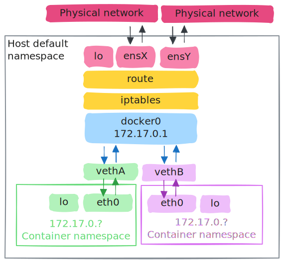
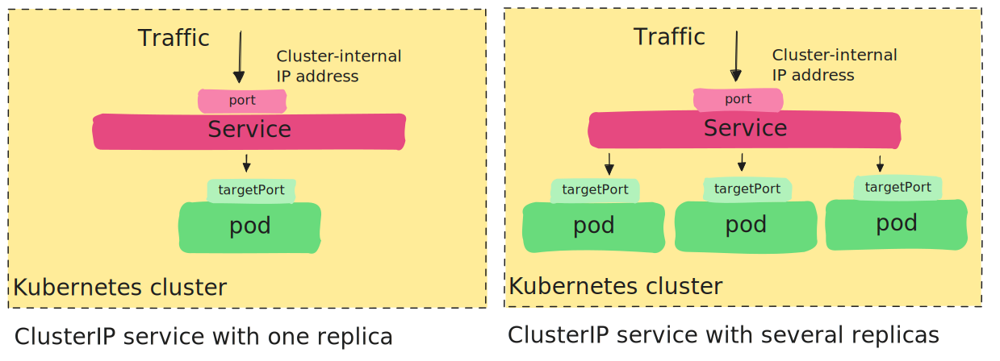

# Cloud Computing on Chameleon

In this tutorial, we will explore some elements of cloud computing infrastructure using Chameleon, an OpenStack cloud (although the basic principles are common to all types of clouds). 

* First, we will provision virtual machines, networks, and ports using the OpenStack GUI, Horizon. Then, we will practice using the CLI. 
* We will use Docker to containerize a simple application and serve it from our cloud resources.
* Finally, we will install Kubernetes on our cluster, and use it to manage our containerized application.

To run this experiment, you should have already created an account on Chameleon, and become part of a project. You should also have added your SSH key to the KVM@TACC site.


## Experiment topology 

In this experiment, we will deploy a Kubernetes cluster on Chameleon instances. The cluster will be self-managed, which means that the infrastructure provider is not responsbile for setting up and maintaining our cluster; *we* are.  

However, the cloud infrastructure provider will provide the compute resources and network resources that we need for our cluster. We will provision the following resources for this experiment:


This includes:

* **Compute resources**: three virtual machine instances.
* **Network resources**: 
  * the VMs will be attached to an Internet-connected network provisioned by the infrastructure provider, and we will use security groups to protect this network.
  * the VMs will also be attached to a "private" network that we provision, on which the virtual machine instances can communicate with one another. We will use the following subnet on this network: 192.168.1.0/24. This means that every VM instance on this network will get an address in the form 192.168.1.X, where X is different for each VM instance on the network.
  * We will get a publicly routable "floating IP" address for one of the VM instances, and add this address to the VM's network interface on the Internet-connected network. This will allow us to SSH to this VM over the Internet, and we can then "hop" from this VM to any of the others.


## Provision a key

Before you begin, open this experiment on Trovi:

* Use this link: [Cloud Computing on Chameleon](https://chameleoncloud.org/experiment/share/a5efb034-917e-4fdd-b83d-1a7f8930d960) on Trovi
* Then, click “Launch on Chameleon”. This will start a new Jupyter server for you, with the experiment materials already in it.

You will see several notebooks inside the `cloud-chi` directory - look for the one titled `0_intro.ipynb`. Open this notebook and execute the following cell (and make sure the correct project is selected):


```python
from chi import server, context

context.version = "1.0" 
context.choose_project()
context.choose_site(default="KVM@TACC")

server.update_keypair()
```


Then, you may continue following along at [Cloud Computing on Chameleon](https://teaching-on-testbeds.github.io/cloud-chi/) until the next part that requires the Jupyter environment. 


## Provision resources using the GUI

We will practice provisioning resources using the GUI and also using the CLI. First, we will practice using the GUI. After completing this section:

* You should be able to provision VM instances, networks, and ports (with appropriate security groups) using the Horizon GUI
* You should be able to associate a floating IP with an instance using the Horizon GUI
* You should be aware of the options for managing a server instance (e.g. reboot, rebuild, delete) using the Horizon GUI


### Access the Horizon GUI

We will use the OpenStack graphical user interface, which is called Horizon, to provision our resources. To access this interface,

* from the [Chameleon website](https://chameleoncloud.org/hardware/)
* click "Experiment" > "KVM@TACC"
* log in if prompted to do so
* check the project drop-down menu near the top left (which shows e.g. "CHI-XXXXXX"), and make sure the correct project is selected.


> **Note**
> 
> Be careful to set the *name* of each resource - network, router, or compute instance - exactly as instructed. 


### Provision a "private" network

First, let's set up our "private" network.

* On the left side of the interface, expand the "Network" menu
* Choose the "Networks" option
* Click the "Create network" button 

You will be prompted to set up your network step by step using a graphical "wizard".

* On the first ("Network") tab, specify the network name as <code>private_cloud_net_<b>netID</b></code> where in place of <code><b>netID</b></code> you substitute your own net ID (e.g. `ff524` in my case). Leave other settings at their defaults, and click "Next".
* On the second ("Subnet") tab, specify the subnet name as <code>private_cloud_subnet_<b>netID</b></code> where in place of <code><b>netID</b></code> you substitute your own net ID (e.g. `ff524` in my case). Specify the subnet address as `192.168.1.0/24`. Check the "Disable gateway" box. Leave other settings at their defaults, and click "Next".
* On the third ("Subnet Details") tab, leave all settings at their default values. Click "Create".

You should now see your network in the list of networks shown in the GUI.  

We have provisioned this part of the overall topology (not including the gray parts):


### Provision a port on our "private" network

When we create a compute instance and want it to have a point of attachment to a network, we can either 

* attach it to a network directly (which will create a port on that network - in the "switch port" sense, not "TCP port" sense - and then attach that port to the network)
* or we can prepare a port on the network in advance, and then when creating the instance, attach it to that port. This may be necessary if we want a non-default configuration on the port, e.g. a fixed IP address instead of one that is assigned dynamically, or to have port security disabled.

We are now going to create a port on our "private" network, and later we will attach a compute instance to it.

* On the left side of the interface, expand the "Network" menu
* Choose the "Networks" option
* Click on the <code>private_cloud_net_<b>netID</b></code> network you created earlier.
* Choose the "Ports" tab from the options on the top.
* Click "Create Port".

We will set up the port as follows:

* Set the Name to <code>port1_<b>netID</b></code>, substituting your own net ID
* In the "Specify IP address or subnet" menu, choose "Fixed IP address"
* Then, in the "Fixed IP Address" field, put `192.168.1.11`
* Un-check the box next to "Port Security"
* Leave other settings at their default values
* Click "Create".

Our topology now looks like this (gray parts are not yet provisioned):


### Set up security groups

On our "private" network, we have disabled security groups, which means that all network traffic is permitted between devices on this network. 

However, on the Internet-facing network that we use to connect to our hosts, we use protect our compute resources from being compromised by using security groups to *only* permit the kinds of network traffic that we will need for our experiment. That is,

* All outgoing traffic from our compute nodes to the Internet
* TCP traffic incoming on port 22, which we need to access our resources over SSH
* TCP traffic incoming on port 80, which we need to accept HTTP connections to our service

Security groups are shared across the project, so the necessary security groups may already exist if another member of your project has set them up! Let's check, and set up if required.

* On the left side of the interface, expand the "Network" menu
* Choose the "Security Groups" option

Look for an entry named `default`, and click "Manage Rules". You should see:

* "Egress" (outgoing) traffic is permitted to any address (`0.0.0.0/0` and `::/0` represent "all IPv4 addresses" and "all IPv6 addresses", respectively), and any port.
* "Ingress" (incoming) traffic is permitted only from other devices within the same `default` security group

Go back to "Security Groups". Next, look for an entry named `allow-ssh`, and if it exists, click "Manage Rules". You should see that this rule permits ingress on TCP port 22, from any IPv4 address.

*If* `allow-ssh` does not already exist, you should create it:

* Click "Create Security Group"
* Set "Name" to `allow-ssh`
* Set "Description" to "Enable SSH traffic on TCP port 22"
* Click "Create Security Group"

then, click "Manage Rules" next to your newly created security group, and "Add Rule":

* Set "Rule" to "Custom TCP Rule"
* Set "Direction" to "Ingress"
* Set "Open Port" to "Port"
* Set "Port" to 22
* Set "Remote" to "CIDR"
* Set "CIDR" to `0.0.0.0/0`


and click "Add". 


Go back to "Security Groups". Look for an entry named `allow-http-80`, and if it exists, click "Manage Rules". You should see that this rule permits ingress on TCP port 80, from any IPv4 address.

*If* `allow-http-80` does not already exist, you should create it:

* Click "Create Security Group"
* Set "Name" to `allow-http-80`
* Set "Description" to "Enable HTTP traffic on TCP port 80"
* Click "Create Security Group"

then, click "Manage Rules" next to your newly created security group, and "Add Rule":

* Set "Rule" to "Custom TCP Rule"
* Set "Direction" to "Ingress"
* Set "Open Port" to "Port"
* Set "Port" to 80
* Set "Remote" to "CIDR"
* Set "CIDR" to `0.0.0.0/0`


and click "Add". 


### Reserve a VM instance

Chameleon Cloud uses reserved VMs, so before we can provision a VM instance, we must make a reservation. General compute VMs are generally not scarce resources, so we can make this reservation immediately before provisioning the instance - we don't have to make it in advance. (For resources that are more in demand, like some types of GPU resources, we would need to make an advance reservation.)

* On the left side of the interface, expand the "Reservations" menu
* Choose the "Leases" option
* Click the "Create Lease" button 

You will be prompted to set up your lease step by step using a graphical "wizard".

* On the first ("General") tab, set the instance name to  <code>lease1_cloud_<b>netID</b></code> where in place of <code><b>netID</b></code> you substitute your own net ID (e.g. `ff524` in my case). Leave other settings at their default values, and click "Next".
* Set the "Start Date" to today's date, and the "Start Time" to a few minutes later than the current time. For most users, the time zone setting is UTC, so you will need to specify the start date and time [in UTC](https://www.timeanddate.com/worldclock/timezone/utc). (You can check your time zone setting in your [User Settings](https://kvm.tacc.chameleoncloud.org/settings/).)
* Set the "End Time" to 8 hours later. 
  * If this will be on the same calendar day as your "Start Date", set "Lease Length" to 0 days. 
  * If this will be on the next calendar day, set "Lease Length" to 1 day.
* In the second ("Flavors") tab, we will specify the resources that will be allocated to the lease. Check the "Reserve Flavors" box. Set "Number of Instances for Flavor" to 1. Then, click "Select" next to `m1.medium`. 
* Click "Create".

### Provision a VM instance

Next, let's create a VM instance.

* On the left side of the interface, expand the "Compute" menu
* Choose the "Instances" option
* Click the "Launch Instance" button 

You will be prompted to set up your instance step by step using a graphical "wizard".


* On the first ("Details") tab, set the instance name to  <code>node1-cloud-<b>netID</b></code> where in place of <code><b>netID</b></code> you substitute your own net ID (e.g. `ff524` in my case). Leave other settings at their default values, and click "Next".
* In the second ("Source") tab, we specify the source disk from which the instance should boot. In the "Select Boot Source" menu, choose "Image". Then, in the "Available" list at the bottom, search for `CC-Ubuntu24.04` (exactly - without any date suffix). Click the arrow next to this entry. You will see the `CC-Ubuntu24.04` image appear in the "Allocated" list. Click "Next".
* In the third ("Flavor") tab, click the arrow next to the lease you made in the previous step.  You will see your "reserved" flavor appear in the "Allocated" list. Click "Next".
* In the fourth ("Networks") tab, we will attach the instance to a network provided by the infrastructure provider which is connected to the Internet.
  * From the "Available" list, click on the arrow next to `sharednet1`. It will appear as item 1 in the "Allocated" list. 
  * Click "Next".
* In the fifth ("Ports") tab, we will additionally use the port we just created to attach the instance to the private network we created earlier. 
  * From the "Available" list, find the port you created earlier. (The subnet is noted by name in the "IP" column. You can search using your net ID to find "your" port.)
  * Click the arrow next to it, and it will appear in the "Allocated" list.
  * Click "Next".
* In the sixth ("Security Groups") tab, we will specify the rules according to which the infrastructure provider will pass traffic to and from our instances. We need to add security groups for any port (in the "TCP port" sense, not the "switch port" sense) on which we will need to receive incoming connections on our instances.
  * Expand the `default` section to see the details of the currently allocated security group, `default`. It is configured to allow egress (outgoing) connections to any remote address (`0.0.0.0/0` means "every address"), but to allow ingress (incoming) connections from no address.
  * From the "Available" list at the bottom, find the `allow-ssh` security group and click the arrow next to it, so that it appears in "Allocated". If you expand this section, you will see that it permits incoming connections from any remote address on TCP port 22, which is used by the SSH service.
  * From the "Available" list at the bottom, find the `allow-http-80` security group and click the arrow next to it, so that it appears in "Allocated". If you expand this section, you will see that it permits incoming connections from any remote address on TCP port 80, which will be used by the web service we will host on our instance.
  * Click "Next".
* In the seventh ("Key Pair") tab, find the SSH key associated with your laptop on the "Available" list. Click on the arrow next to it to move it to the "Allocated" section. 
* In the eighth ("Customization") tab, paste the following into the text input field:

```
#cloud-config
runcmd:
  - echo "127.0.1.1 $(hostname)" >> /etc/hosts
  - su cc -c /usr/local/bin/cc-load-public-keys
```

Then you can click "Launch Instance" (the remaining tabs are not required).

You will see your instance appear in the list of compute instances, initally in the "Spawning" state. Within a few moments, it will go to the "Running" state. 

Click on the &#x25BC; menu to the far right side of the running compute instance, to see the options that are available. You will see that you can do things like:

* restart the instance
* rebuild the instance (load the same or a different disk image)
* or delete the instance

using the GUI. You also can click on the instance name to see the "Overview" according to the configuration you just specified.

Our topology now looks like this (gray parts are not yet provisioned):


### Provision a floating IP

The VM instance currently has only "private" addresses which are not reachable over the Internet:

* It has an address in the 192.168.1.0/24 "private" network we created. This network is not connected to the Internet.
* It has an address in the 10.56.0.0/22 subnet on the `sharednet1` network provided by Chameleon for Internet access. However, while this network allows the instance to initiate a connection to an endpoint on the Internet (using NAT), it is still within the private address range, so it is not usable for initiating a connection *to* the instance across the Internet.

We are going to provision and attach a "floating IP", which is a public address that will allow us to initiate a connection to the instance across the Internet.

* On the left side of the interface, expand the "Network" menu
* Choose the "Floating IPs" option
* Click "Allocate IP to project"
* In the "Pool" menu, choose "public"
* In the "Description" field, write: <code>Cloud IP for <b>netID</b></code>, where in place of <code><b>netID</b></code> you use your own net ID.
* Click "Allocate IP"
* Then, choose "Associate" next to "your" IP in the list.
* In the "Port" menu, choose the port associated with your <code>node1-cloud-<b>netID</b></code> instance on the `shared1` network, with an IP address of the form `10.56.X.X`.
* Click "Associate".

Our topology now looks like this (gray parts are not yet provisioned):


### Access your instance over SSH

Now, you should be able to access your instance over SSH! Test it now. From your local terminal, run

```
ssh -i ~/.ssh/id_rsa_chameleon cc@A.B.C.D
```

where

* in place of `~/.ssh/id_rsa_chameleon`, substitute the path to your own key that you had uploaded to KVM@TACC
* in place of `A.B.C.D`, use the floating IP address you just associated to your instance.

and confirm that you can access the compute instance. Run

```
hostnamectl
```

inside this SSH session to see details about the host.

Also, run


```
echo "127.0.0.1 $(hostname)" | sudo tee -a /etc/hosts
```

inside the SSH session

### Provision additional instances

We *could* use a similar procedure to provision the two additional VMs we will need, but that's a lot of clicks! Instead, we will use the `openstack` command line interface.


## Provision resources using the `openstack` CLI


Although the GUI is useful for exploring the capabilities of a cloud, the command line interface is much more efficient for provisioning resources. In this section, we will practice using the `openstack` CLI to explore the capabilities of our cloud and manage resources.

To follow along, open this experiment on Trovi:

* Use this link: [Cloud Computing on Chameleon](https://chameleoncloud.org/experiment/share/a5efb034-917e-4fdd-b83d-1a7f8930d960) on Trovi
* Then, click “Launch on Chameleon”. This will start a new Jupyter server for you, with the experiment materials already in it.

You will see several notebooks inside the `cloud-chi` directory - look for the one titled `2_provision_cli.ipynb`. Note that this is a `bash` notebook that executes `bash` commands on the terminal in the Jupyter environment. 

After completing this section:

* You should be able to provision server instances and ports using the `openstack` CLI
* You should be able to use the `openstack` CLI to see already provisioned resources


When we left off in the previous section, we had provisioned part of our overall topology (not including the gray parts):


Now, we will provision the rest.


### Authentication

When we use the GUI to provision and manage resources, we had to sign in first. Similarly, to use the CLI, we must authenticate with the OpenStack Keystone service. However, the Chameleon JupyterHub instance that we are running this notebook on is already configured to authenticate the `openstack` client.

We just need to set some additional environment variables that specify which Chameleon site we want to use (KVM@TACC) and which project. In the cell below, replace `CHI-XXXXXX` with the name of *your* Chameleon project, then run the cell.


```bash
export OS_AUTH_URL=https://kvm.tacc.chameleoncloud.org:5000/v3
export OS_PROJECT_NAME="CHI-XXXXXX"
export OS_REGION_NAME="KVM@TACC"
```

<!-- 

### Other setup

The OpenStack CLI installed in this JupyterHub environment is not the most recent version, and we need some features that are only available in the most recent version (namely: VM instance reservation). So, we must update the Blazar (reservation service) client, and then make sure the shell will use that updated version.


```bash
PYTHONUSERBASE=/work/.local pip install --user git+https://github.com/ChameleonCloud/python-blazarclient.git
export PATH=/work/.local/bin:$PATH
```

-->


### Exploring the cloud

The openstack CLI has many capabilities, most of which we won't touch at all. Run the following cell to see some of them:


```bash
openstack help
```


Note, however, that some of these commands are unavailable to use because of access management policies (e.g. some commands are only available to the cloud infrastructure provider) and because the OpenStack cloud we are using may not necessarily include all of the possible services that an OpenStack cloud *can* offer.

To see the services available from the current site (KVM@TACC), run


```bash
openstack catalog list
```


### Work with network resources

Before we provision new resources, let's look at the resources we created earlier. We'll start with the network resources.


We can list all of the networks that are provisioned by our project at KVM@TACC:


```bash
openstack network list
```


but there may be a lot of them! We can use `grep` to filter this output by our own net ID, to see the private network we created earlier. In the cell below, replace **netID** with your *own* net ID before you run it.


```bash
openstack network list | grep netID
```


You can also get the details of any network by specifying its name or ID, e.g. in the cell below replace **netID** with your own net ID - 


```bash
openstack network show private_cloud_net_netID
```


```bash
openstack network show sharednet1
```


We can similarly see the subnets we created earlier. In the two cells below, replace **netID** with your *own* net ID before you run them.


```bash
openstack subnet list | grep netID
```

```bash
openstack subnet show private_cloud_subnet_netID
```


Let's add two more ports to our private network now. First, to see usage information:


```bash
openstack port create -h
```


Note that there are many more options available via the CLI than the GUI.

Now we will create two ports with the same options (fixed IP, no port security) as before - we will specify `192.168.1.12` and `192.168.1.13` as the fixed IP address for these new ports, and we will also give them each a name (to make it easier to use the port in subsequent `openstack` commands).

In the following two cells, you will need to replace **netID** with your own net ID *three* times in each - in the name of the network, in the name of the subnet, and in the name of the port.


```bash
openstack port create \
    --network private_cloud_net_netID \
     --fixed-ip subnet=private_cloud_subnet_netID,ip-address=192.168.1.12 \
     --disable-port-security \
     port2_netID
```


```bash
openstack port create \
    --network private_cloud_net_netID \
     --fixed-ip subnet=private_cloud_subnet_netID,ip-address=192.168.1.13 \
     --disable-port-security \
     port3_netID
```


and then you may list ports on the network (substitute with your own net ID):


```bash
openstack port list --network private_cloud_net_netID
```


Now, our topology looks like this:


### Work with compute resources

Next, let's look at the compute resources.


First, since Chameleon requires reservations for compute instances, we'll need a reservation. Check the current reservation list with:


```bash
openstack reservation lease list
```


We will create a single lease with reservations for **two** `m1.medium` flavors, for 8 hours. We will use the `date` command to automatically set the start and end time.

In the cell below, replace **netID** with your own net ID, then run it to request a lease:


```bash
openstack reservation lease create lease2_cloud_netID \
  --start-date "$(date -u '+%Y-%m-%d %H:%M')" \
  --end-date "$(date -u -d '+8 hours' '+%Y-%m-%d %H:%M')" \
  --reservation "resource_type=flavor:instance,flavor_id=$(openstack flavor show m1.medium -f value -c id),amount=2"
```


Then, check the list again:


```bash
openstack reservation lease list
```


Now, we are ready to create some additional server instances.

In the cell below, replace **netID** with your own net ID to see a list of already-provisioned servers that have your net ID in their name:


```bash
openstack server list --name "netID"
```


We are going to add two more. First, to see usage information:


```bash
openstack server create -h
```


We are going to want to specify the image name and the key to install on the new compute instances, along with their network connectivity. We already confirmed the network resources, but let's look at the rest to make sure we know what everything is called:


```bash
# there are MANY images available, so we'll just list a few
openstack image list --limit 5
```


```bash
openstack keypair list
```


We are also going to need to get the reserved "flavor" ID, from the reservation we just made. We'll save this in a variable `flavor_id` so that we can reuse it in our `openstack server create` command.

In the cell below, replace **netID** with your own net ID in the lease name. This cell should print a UUID:


```bash
flavor_id=$(openstack reservation lease show lease2_cloud_netID -f json -c reservations \
      | jq -r '.reservations[0].flavor_id')
echo $flavor_id
```


Now we can launch our additional compute instances! In the two cells below, you will need to 

* replace **netID** with your own net ID in the port name
* replace `id_rsa_chameleon` with the name of the key as listed in Chameleon, if it is different
* replace **netID** with your own net ID in the name of the server (last line)


```bash
openstack server create \
  --image "CC-Ubuntu24.04" \
  --flavor $flavor_id \
  --network sharednet1 \
  --port port2_netID \
  --security-group default \
  --security-group allow-ssh \
  --security-group allow-http-80 \
  --key-name id_rsa_chameleon \
  --user-data config-hosts.yaml \
  node2-cloud-netID
```

```bash
openstack server create \
  --image "CC-Ubuntu24.04" \
  --flavor $flavor_id \
  --network sharednet1 \
  --port port3_netID \
  --security-group default \
  --security-group allow-ssh \
  --security-group allow-http-80 \
  --key-name id_rsa_chameleon \
  --user-data config-hosts.yaml \
  node3-cloud-netID
```


You can get your new server list with 


```bash
openstack server list --name "netID"
```


Finally, our topology looks like this:


> **Note**
> 
> You may have noticed that in Openstack, everything - network, port, subnet, flavor, disk image, compute instance, etc. - has an ID associated with it. In the commands above, we used names, but we could have used IDs (and if there were duplicate resources with the same name, we would have to use IDs).


Now that we have resources, in the next section we will deploy a containerized application on them.


## Deploy a service in a Docker container


At this point, we have compute resources on which we could deploy a service directly - but we want to make sure that we deploy a service in a way that is scalable (like cattle, not like pets). So, install of installing libraries and middleware and deploying a service "natively", we will do all this inside a container.

After completing this section:

* You should be able to `pull` a Docker container and `run` a container (either in detached or interactive/TTY mode)
* You should be able to use `docker ps` to see running containers, `docker logs` to see output of a running proess in a container, and `docker stop` to stop containers.
* You should be able to describe how network traffic to or from a Docker container is passed to the container by the host
* You should be able to use `-p HOST_PORT:CONTAINER_PORT` to publish a port from the container to the host (and you should understand when you need to)
* You should be able to describe how the overlay filesystem used by Docker works, and how it enables container images to be shared by many instances of a running container
* You should be able to use volumes and bind mounts to make a persistent filesystem available to a container
* You should be able to build a container using a Dockerfile

In this section, we will run *all* commands on the `node1` host we brought up earlier, or inside a container on this host, by copying and pasting into the terminal. (Use SSH to connect to this server.) We won't execute any cells in the *notebook* interface in this section. A comment at the top of each code block will specify where the command should run.


### Install a container engine

First, we need to install the Docker engine. On `node1`, run

```bash
# run on node1 host
sudo apt-get update
sudo apt-get -y install ca-certificates curl

curl -sSL https://get.docker.com/ | sudo sh
```

If we try to use `docker` now, though, we will get an error message:


```
docker: permission denied while trying to connect to the Docker daemon socket at unix:///var/run/docker.sock: Head "http://%2Fvar%2Frun%2Fdocker.sock/_ping": dial unix /var/run/docker.sock: connect: permission denied.
See 'docker run --help'.
```

because before we can run `docker` commands as an unprivileged user, we need to add the user to the `docker` group:

```bash
# run on node1 host
sudo groupadd -f docker; sudo usermod -aG docker $USER
```

then, we need to end the SSH session (`exit`) and open a new one for the change to be reflected. 

After opening a new SSH session, if we run 

```bash
# run on node1 host
id
```

we should see a  group named `docker` listed in the output, indicating that the `cc` user is part of the `docker` group. Now, we can run 

```bash
# run on node1 host
docker run hello-world
```

and we should see a "Hello from Docker!" message.


We are going to practice building a container, but first, we want to understand a bit more about how containers work, and especially, how to share network and filesystem resources between the host and the container in a controlled and secure way.

### Container networking 

Containers need to be able to communicate with other containers and/or the Internet in order to do their jobs. However, we also want to be sure that containers are isolated from each other and from the host - a container should only have access to its own network traffic, and network configurations such as routing rules or firewall rules applied inside a container should not affect the host.

> **Note**: 
> Docker has a few networking "types": `bridge`, `host`, `none`. This section describes `bridge` mode, which is the default.

By default, this is implemented as follows in Docker:

Before any container is started, a `docker0` interface is created on the host. This is a *bridge* network interface, which acts as a virtual switch to connect containers to one another, and to connect containers to the outside world by routing through the host's network interfaces. We can see this interface with

```bash
# run on node1 host
ip addr show docker0
```

Note that the IP address of this interface (`inet`) is specified as `172.17.0.1/16`, which (`172.17.0.1`) is the first address in the private address subnet 172.17.0.1 - 172.17.255.254. 

We can also see Docker-specific settings for this network using 

```bash
# run on node1 host
docker network inspect bridge
```

Docker uses [packet filtering and firewall rules](https://docs.docker.com/engine/network/packet-filtering-firewalls/) on this bridge network to enforce policies that are specified for containers. If we run 

```bash
# run on node1 host
sudo iptables --list -n
sudo iptables --list -n -t nat
```

we will see some firewall "chains" listed: `DOCKER-USER` for user-defined rules, `DOCKER` which will apply the port forwarding configuration we specify when we run a container, and `DOCKER-ISOLATION-STAGE-1` and `DOCKER-ISOLATION-STAGE-2` which are used to isolate container networks from one another.


Once we run a container, 

* A network *namespace* is created for the container. This is a feature of the Linux kernel that provides an independent network stack (including network interfaces, routing tables, firewall rules, etc.). 
* Within the container's network namespace, a new "Ethernet" interface will be created, and will be assigned an address in that same 172.17.0.1 - 172.17.255.254 private address range.
* On the *host*, a virtual Ethernet interface (`veth`) will be created. This is like a virtual "network cable" that connects the container's network namespace to the `docker0` bridge.

Now the container has a complete network stack (provided by its own network namespace) that is isolated from the host network and other containers, but it also has a connection to a bridge via which it can reach the outside world (according to the rules that will be set up by the Docker engine in `iptables`, and routes that are already configured on the host).

The overall networking setup is illustrated as follows:




To see how it all works, we're going to run a container. We will need two SSH sessions on `node1` - 

* in one, we'll inspect the network configuration on the host
* in the second, we'll attach to the container and inspect the network configuration there

Let's get the latest [`alpine` Linux container from the DockerHub registry](https://hub.docker.com/_/alpine):

```bash
# run on node1 host
docker pull alpine
```

If we just run the container with:

```bash
# run on node1 host
docker run alpine
```

nothing much will happen. Unlike a virtual machine, a container does not "live" forever until it is shut down; it "lives" only as long as whatever process we start inside it is still running.

Let's run it with a persistent terminal, so that we can interact with the container:

```bash
# run on node1 host
docker run --name alpine-shell -it --rm alpine
```

 The `-it` flags mean to start the container
 
 * `-i` interactive (so we can type into it), 
 * `-t` with a TTY (a terminal where we can see output of the commands we type)

 and

  * `--name alpine-shell` gives the container a predictable name. (Note the *container name* can be anything we want! If we did not specify a name, a random name would be assigned and we could find out what it is from the `docker ps` output.) 
 * `--rm` removes the container when it stops, so we can re-run this command without cleanup


The terminal prompt will change, indicating that we are now executing commands directly inside the container. Note the `#` at the end of the prompt, which signals that we are running commands as an admin (`root`) user inside the contaier.

On the *host* (not inside the container), run

```bash
# run on node1 host
docker ps
```

to see the details of the running container. Then, still on the *host*, run 


```bash
# run on node1 host
docker network inspect bridge
```

again. Note that now, there is an entry in the "Containers" section, with the details of the container we just started.

Also run 

```bash
# run on node1 host
ip addr
```

on the *host*, and look at the new `veth` interface. In particular, note that

* it says `master docker0` - this means it connected to a "port" on the `docker0` bridge.
* and that it includes a `link-netnsid` field with an integer value (e.g. 0, 1, 2), which indicates the network namespace it connects to.


Now, *on the root shell that is running inside the container*, run 


```bash
# run inside alpine container
ip addr
```

in the container, to see a list of network interfaces and the addresses associated with them.

We should see:

* a loopback interface named `lo`. The loopback interface is used for communication between processes *within* the container using network protocols. 
* an interface typically named `eth0`, which in this case is a virtual Ethernet interface. It has an address in the private address subnet 172.17.0.1 - 172.17.255.254.

Let's test our network connectivity inside the container. In the container, run

```bash
# run inside alpine container
traceroute 1.1.1.1
```

to get a list of "network hops" from the container, to the address `1.1.1.1` (CloudFlare's DNS service on the public Internet). You should see that 

* the first hop is the gateway address on the `docker0` subnet, `172.17.0.1`
* the second hop is a gateway on the `shared1` network on Chameleon
* and from there, we can reach the TACC network and then the Internet.


Inside the container, run

```bash
# run inside alpine container
exit
```

to leave the terminal session.


#### Publishing a port

Now we understand how a container can connect *out* to resources on the Internet, but we need a few more things in place before we can establish a connection *to* a container from the Internet.


We'll run another container:

```bash
# run on node1 host
docker run --name nginx-demo -d --rm nginx:alpine
```

`nginx` is a lightweight web server, and we are running it on top of `alpine` Linux. The image name `nginx:alpine` uses a *tag* (`alpine`) to select a specific variant of the `nginx` image; tags let you choose which version of an image to run.

Also, 

* `--name nginx-demo` gives the container a predictable name. 
* the `-d` says to run the container in "detached" mode (in the background), 
* `--rm` removes it once it stops, 

There should now be a web server running on TCP port 80 (the default HTTP server port) inside the container.

This container image is configured to start a long-lived process (the `nginx` server) when it is run, which is why we don't need an interactive terminal and it doesn't terminate immediately. Run

```bash
# run on node1 host
docker logs nginx-demo
```

to see the output of the long-lived command and confirm it is running.

The `nginx` image is configured to *expose* TCP port 80 outside of itself - if you run 

```bash
# run on node1 host
docker image inspect nginx:alpine
```

on the *host* terminal, you will see this in the "ExposedPorts" section.

On the host terminal, use

```bash
# run on node1 host
docker network inspect bridge
```

to find out the IP address of the `nginx` container (e.g. 172.17.0.2). Finally, you can run


```bash
# run on node1 host
curl http://172.17.0.X/
```

where in place of `X` you substitute the appropriate value for *your* container, to see the home page served by the `nginx` web server in the container. 


However, it's not very useful to serve a web page that is only accessible inside the Docker host! Try putting


```
http://A.B.C.D
```

in the address bar of *your own* browser (on your laptop), substituting the floating IP assigned to the instance. The service will not accept incoming connections, because the Docker container's listening port is not mapped to a listening port on the host.

We're going to want to make this container available on node1's public IP address.

To do this, let's first stop the running container. Run

```bash
# run on node1 host
docker ps
```

to get the details of the container. Then, run

```bash
# run on node1 host
docker stop nginx-demo
```

This stops the `nginx-demo` container we started above. (You can also use a container ID from `docker ps`.)

Now, we'll run our container again, but with the addition of the `-p` argument:

```bash
# run on node1 host
docker run --name nginx-public -d --rm -p 80:80 nginx:alpine
```

which specifies that we want to *publish* the container's port 80 (the second `80` in the argument) to the host port 80 (the first `80` in the argument).

On the host, get the IP address of the host network interface that is on the `sharednet1` network, with


```bash
# run on node1 host
ip addr
```

It will have an address of the form `10.56.X.Y`. Then, run

```bash
# run on node1 host
curl http://10.56.X.Y/
```

(substituting the IP address you found from `ip addr`). Now, the web server is accessible from the host's IP address - not only the container's IP address.

Finally, since we had configured this instance with a floating IP and a security group to allow incoming connections on TCP port 80, we can access this web server from outside the host, too!

In your *own* browser running on your laptop, put the floating IP assigned to your instance in the address bar, as in

```
http://A.B.C.D/
```

You should see the `nginx` welcome page.

This mapping between host port and container port is achieved by a forwarding rule - run

```bash
# run on node1 host
sudo iptables --list -n
sudo iptables --list -n -t nat
```

on the host, and note that the `DOCKER` chain now includes additional rules to handle this mapping.

Stop the running container. Run

```bash
# run on node1 host
docker ps
```

to get the details of the container. Then, run

```bash
# run on node1 host
docker stop nginx-public
```

This stops the `nginx-public` container we started above. (You can also use a container ID from `docker ps`.)


### Container filesystems

To explore the Docker filesystem, it will be helpful to have the `tree` utility, so let's install it:

```bash
# run on node1 host
sudo apt update
sudo apt -y install tree
```

Then, let's get back into our `nginx` container.  First, we'll start the container in detached mode:

```bash
# run on node1 host
docker run --name nginx-1 -d --rm nginx:alpine
```

Then, we'll open a `sh` shell on the container in interactive (TTY) mode using `docker exec`:

```bash
# run on node1 host
docker exec -it nginx-1 /bin/sh
```

If you now run

```bash
# run inside nginx-1 container
df
```

inside the container, you will note that the root of the file tree (`/`) is on an **overlay** file system. The overlay file system is what makes containers so flexible and lightweight! 

A Docker container image is made out of *read-only* image layers.

* there is the base layer, 
* and then there are layers created by the additional instructions used to build the container image, which are stacked on top of the base layer.

Because these layers are read-only, they can be re-used - if I spin up another instance of the same container, for example, I don't have to worry that these layers have been modified by the previous instance.

Then, when you create a container from an image, Docker adds a *read-write* layer, which is called a container layer, on top of those image layers. You can create or edit files inside the Docker container. (Changes are made to files in a kind of staging area called the "workdir", then they are copied to the container layer.) But, your changes are temporary - they last only as long as the container is running. 

From the point of view of processes running inside the Docker container, the filesystem looks like a "merged" version of the image layers and the container layer.

The overall setup is illustrated as follows:


Let's look at these layers. On the *host* (not inside the container), first get the container ID:

```bash
# run on node1 host
CID=$(docker inspect -f '{{.Id}}' nginx-1)
echo "$CID"
```

and use it to locate the container's filesystem:

```bash
# run on node1 host
sudo ctr -n moby snapshots ls | grep "$CID"
```

You will see

* an entry with `KIND` set to `Active` - this represents the container’s writable filesystem and, when mounted, shows the "merged" view
* and an entry with `KIND` set to `Committed` - this is the read-only snapshot.

We'll dig a little deeper. Let's save paths in Bash variables corresponding to the "upperdir" and "lowerdir", to make them easier to use:

```bash
# run on node1 host
sudo mkdir -p /tmp/ctr-tmp
MOUNT_OUT=$(sudo ctr -n moby snapshots mount /tmp/ctr-tmp "$CID" 2>&1)
UPPERDIR=$(echo "$MOUNT_OUT" | sed -n 's/.*upperdir=\([^,]*\).*/\1/p')
LOWERDIRS=($(echo "$MOUNT_OUT" | sed -n 's/.*lowerdir=\([^,]*\).*/\1/p' | tr ':' ' '))
sudo umount /tmp/ctr-tmp 2>/dev/null || true
```

and a Bash variable corresponding to the "merged" view:

```bash
# run on node1 host
PID=$(docker inspect -f '{{.State.Pid}}' nginx-1)
MERGED=/proc/$PID/root
```

Now the variable `UPPERDIR` points to the writable container layer:

```bash
# run on node1 host
echo $UPPERDIR
```

and the array `LOWERDIRS` contains one entry per read-only image layer:

```bash
# run on node1 host
printf 'LOWERDIR=%s\n' "${LOWERDIRS[@]}"
```

If we further explore these directories with `ls` and `cat`, it will become clear how these layers represent the changes made to the container image by the commands described in [the file used to build the image](https://github.com/nginxinc/docker-nginx/blob/master/Dockerfile-alpine-slim.template).

Currently, the "upperdir" has any files created or edited in the container layer, with updated files in the container layer replacing their original version in the image layer. You can see the contents of the "upperdir" as a tree by running:

```bash
# run on node1 host
sudo tree $UPPERDIR
```

(This layer currently has files that are edited or created automatically when the `nginx` process started at the beginning of the container's lifetime.)

You can see the same list of files as a "diff" - try

```bash
# run on node1 host
docker diff nginx-1
```

Let's edit a file in the container layer to see how the overlay filesystem works! Inside the container, run

```bash
# run inside nginx-1 container
vi /usr/share/nginx/html/index.html
```

(If you haven't used `vi` before, follow these instructions very carefully - some of the keystrokes mentioned are commands that control the behavior of the editor, not text that appears in the output, which can be confusing if you are not used to it.) Use the arrow keys on your keyboard to navigate to the line that says

```
<h1>Welcome to nginx!</h1>
```

and to position your cursor right before the `!`. Then, type `i` to change from command mode to insert mode. Use the backspace key to erase `nginx` and replace it with `ECE-GY 9183`, so it says: `Welcome to ECE-GY 9183!`. Use the `Esc` key to get back to command mode, and type `:wq`, then hit Enter, to save and close the editor.

To test your work, on the *host*, get the IP address of the container with

```bash
# run on node1 host
docker inspect nginx-1
```

and then use 

```bash
# run on node1 host
curl http://172.17.0.X/
```

(substituting the actual IP address) to view the page and confirm that it now says "Welcome to ECE-GY 9183!".

Now, let's see the effect of this change in the filesystem.  First, we will look at the same file in the (read-only) image layers:

```bash
# run on node1 host
for dir in "${LOWERDIRS[@]}"; do
    FILE="$dir/usr/share/nginx/html/index.html"
    sudo bash -c "[ -f '$FILE' ] && echo \"$dir:\" && cat '$FILE'"
done
```

In the (writeable) container layer, though, this same file has been modified. Note that the file now appears in

```bash
# run on node1 host
sudo tree $UPPERDIR
```

and in 

```bash
# run on node1 host
docker diff nginx-1
```

and we can see from the file contents in the (writeable) container layer that it reflects the changes we have made:


```bash
# run on node1 host
sudo cat "$UPPERDIR/usr/share/nginx/html/index.html"
```

Finally, we note that in the "merged" directory (which is what processes inside the container will see!) we see the updated version of this file.


```bash
# run on node1 host
sudo cat "$MERGED/usr/share/nginx/html/index.html"
```


Now, we're going to run a second instance of the `nginx` container! On the host, run

```bash
# run on node1 host
docker run --name nginx-2 -d --rm nginx:alpine
```

and then 

```bash
# run on node1 host
CID2=$(docker inspect -f '{{.Id}}' nginx-2)
sudo ctr -n moby snapshots ls | grep "$CID2"
```

Then run

```bash
# run on node1 host
sudo mkdir -p /tmp/ctr-tmp
MOUNT_OUT2=$(sudo ctr -n moby snapshots mount /tmp/ctr-tmp "$CID2" 2>&1)
UPPERDIR2=$(echo "$MOUNT_OUT2" | sed -n 's/.*upperdir=\([^,]*\).*/\1/p')
LOWERDIRS2=($(echo "$MOUNT_OUT2" | sed -n 's/.*lowerdir=\([^,]*\).*/\1/p' | tr ':' ' '))
sudo umount /tmp/ctr-tmp 2>/dev/null || true
```

to get the "upperdir" and "lowerdir" for this container.

If you compare the "lowerdir" layers for the first and second container:

```bash
# run on node1 host
printf 'LOWERDIR=%s\n' "${LOWERDIRS[@]}"
```

```bash
# run on node1 host
printf 'LOWERDIR2=%s\n' "${LOWERDIRS2[@]}"
```

You will notice that except for the top layer, which is not strictly part of the image, the second instance of the container has exactly the same file paths for the "lowerdir" (read-only image layers) - in other words, there is a single copy of the image layers that is used by *all* instances of this container. 

However, it has its own separate "upperdir" container layer, since the container may write to these.

```bash
# run on node1 host
echo $UPPERDIR
```

```bash
# run on node1 host
echo $UPPERDIR2
```

Stop both running containers:

```bash
# run on node1 host
docker stop nginx-1
docker stop nginx-2
```

#### Volume mounts

With the overlay filesystem, a single copy of the container image on disk can be shared by *all* container instances using that image. Each container instance only needs to maintain its own local changes, in the container layer.

Sometimes, we may want to *persist* some files beyond the lifetime of the container. For persistent storage, we can create a [volume](https://docs.docker.com/engine/storage/volumes/) in Docker and attach it to a container.

Let's create a volume now. We will use this volume to store HTML files for our `nginx` web site:

```bash
# run on node1 host
docker volume create webvol
```

Now, let us run the `nginx` container, and we will mount the `webvol` volume at `/usr/share/nginx/html` inside the container filesystem:

```bash
# run on node1 host
docker run --name nginx-vol -d --rm -v webvol:/usr/share/nginx/html -p 80:80 nginx:alpine
```

Since the `/usr/share/nginx/html` directory in the container already contains files (these are created automatically by the `nginx` installation), they will be copied to the volume. If we visit our web service using a browser, we will see the "Welcome to nginx" message on the home page.


Let us edit the home page. Run an `alpine` Linux container and mount this volume to the position `/data/web`, using the `-v` argument:


```bash
# run on node1 host
docker run --rm -it -v webvol:/data/web alpine
```

*Inside* the container, we can edit the HTML files in the `/data/web` directory

```bash
# run inside alpine container
cd /data/web
vi index.html
```

Use the arrow keys on your keyboard to navigate to the line that says

```
<h1>Welcome to nginx!</h1>
```

and to position your cursor right before the `!`. Then, type `i` to change from command mode to insert mode. Use the backspace key to erase `nginx` and replace it with `docker volumes`.  Use the `Esc` key to get back to command mode, and type `:wq`, then hit Enter, to save and close the editor. Then, you can type

```bash
# run inside alpine container
exit
```

inside the container, to close the terminal session on the `alpine` container.

Now, visit the web service using a browser, and we will see the "Welcome to nginx" message has changed to a "Welcome to docker volumes" message.

Furthermore, the data in the volume persists across containers and container instances. To verify this:

* Use `docker ps` and `docker stop` on the host to stop all running containers. (You can also use `docker container prune` to completely remove all stopped containers.)
* Then, start the `nginx` container again with the volume mounted, and check the home page of the web service.


#### Bind mounts

While volumes make persistent data available to containers, the data inside the volumes is not easily accessible from the host operating system. For some use cases, we may want to create or modify data inside a container, and then have that data also be available to the host (or vice versa).

Try running your `nginx` container, but attach the `/usr/share/nginx/html` directory in the container to the `~/data` directory

```bash
# run on node1 host
docker run --name nginx-bind -d --rm -v ~/data/web:/usr/share/nginx/html -p 80:80 nginx:alpine
```

Then, on the host, create a new HTML file inside `~/data/web`:

```bash
# run on node1 host
sudo vim ~/data/web/index.html
```

Type `i` to change from command mode to insert mode. Then, paste the HTML below:


```html
<!DOCTYPE html>
<html lang="en">
  <head>
    <meta charset="UTF-8">
    <title>Hello world</title>
  </head>
  <body>
    <p>Hello bind mounts</p>
  </body>
</html>
```

Use the `Esc` key to get back to command mode, and type `:wq`, then hit Enter, to save and close the editor. 

Now, visit the web service using a browser, and we will see HTML file we just created.  Furthermore, the data persists across containers and container instances. To verify this:

* Use `docker ps` and `docker stop` on the host to stop the running container. (You can also use `docker container prune` to completely remove all stopped containers.)
* Then, start the `nginx` container again with the volume mounted, and check the home page of the web service.

Also note that we can edit the data in `~/data/web/` from the host even when no container is attached to it.

Use `docker ps` and `docker stop` on the host to stop all running containers before you move on to the next section.

### Build and serve a container for a machine learning model


Finally, we're going to build our own container, and use it to serve a machine learning model!

The premise of this service is as follows: You are working at a machine learning engineer at a small startup company called GourmetGram. They are developing an online photo sharing community focused on food. You are testing a new model you have developed that automatically classifies photos of food into one of a set of categories: Bread, Dairy product, Dessert, Egg, Fried food, Meat, Noodles/Pasta, Rice, Seafood, Soup, and Vegetable/Fruit. You have built a simple web application with which to test your model and get feedback from others.

The source code for your web application is at: [https://github.com/teaching-on-testbeds/gourmetgram](https://github.com/teaching-on-testbeds/gourmetgram). Retrieve it on node1 with

```bash
# run on node1 host
git clone https://github.com/teaching-on-testbeds/gourmetgram gourmetgram
```

The repository includes the following materials:

```
  -   instance/
  -   static/
  -   templates/
  -   food11.pth
  -   app.py
  -   requirements.txt
  -   Dockerfile
```

where

* `static` and `templates` are directories containing the HTML, CSS, and JS materials to implement the front end
* `food11.pth` is a Pytorch model,
* `app.py` implements a web application in Flask serving this model, 
* `requirements.txt` specifies the Python libraries required, 
* and `Dockerfile` is a set of instructions for building a container image. 

We can take a closer look at the `Dockerfile` to see how the container image will be built. It is based on a Python image; then it installs Python libraries, copies the contents of the repository into the working directory, exposes port 8000 on the container, and then runs the Python application (which will listen for incoming connections on port 8000).

```
# Use an official Python runtime as a parent image
FROM python:3.11-slim-buster

# Set the working directory to /app
WORKDIR /app

# Copy the requirements.txt into the container at /app
# we do this separately so that the "expensive" build step (pip install)
# does not need to be repeated if other files in /app change.
COPY requirements.txt /app

# Install any needed packages specified in requirements.txt
RUN pip install --trusted-host pypi.python.org -r requirements.txt

# Copy the current directory contents into the container at /app
COPY . /app

# Expose the port on which the app will run
EXPOSE 8000

# Run the command to start the Flask server
CMD ["python","app.py"]
```

We can use this file to build a container image as follows: we run


```bash
# run on node1 host
docker build -t gourmetgram-app:0.0.1 gourmetgram
```

which builds the image from the directory `gourmetgram`, gives the image the name `gourmetgram-app`, and gives it the tag `0.0.1` (typically this is a version number).

Now, we can run the container with

```bash
# run on node1 host
docker run --name gourmetgram-app -d --rm -p 80:8000 gourmetgram-app:0.0.1
```

Put

```
http://A.B.C.D
```

in the address bar of *your own* browser (on your laptop), substituting the floating IP assigned to the instance. Try uploading an image of a food item to the service, and see what "tag" is assigned by the model.


Now that we have a basic deployment, in the next section we will scale it up using Kubernetes.

## Deploy on Kubernetes

Although we can deploy a service directly using a container, a container orchestration framework (like Kubernetes) will help us scale a deployment:

* If a container fails, Kubernetes can automatically detect it and replace it with a functional container.
* Kubernetes can deploy multiple instances of a container across several hosts, and balance the load across them.
* Kubernetes can automatically scale the deployment in response to load.

After completing this section:

* You should be able to deploy a Kubernetes cluster using `kubespray`
* You should be able to deploy a service in Kubernetes with multiple replicas for load balancing
* You should be able to use horizontal scaling to automatically adjust the number of replicas


### Preliminaries

This subsection involves running commands on the hosts in our cluster (node1, node2, and node3) by using SSH from the Chameleon JupyterHub environment, then running commands inside the SSH session.

Inside the Chameleon JupyterHub environment, open three terminals:

**SSH to node1**: In the first terminal, SSH to the node1 using the floating IP address assigned to it (substitute this IP for `A.B.C.D`):

```
ssh -A cc@A.B.C.D
```

Note the `-A` argument - this is important. The `-A` allows us to "jump" from node1 to another node using the same key with which we authenticated to node1.

**SSH to node2**: In the second terminal, run the following command (substitute the floating IP assigned to your node1 for `A.B.C.D`) to SSH to node2, but using node1 to "jump" there (since node2 does not have a floating IP assigned, we cannot SSH to it directly):

```
ssh -A -J cc@A.B.C.D cc@192.168.1.12
```


**SSH to node3**: In the second terminal, run the following command (substitute the floating IP assigned to your node1 for `A.B.C.D`) to SSH to node3, but using node1 to "jump" there (since node3 does not have a floating IP assigned, we cannot SSH to it directly):

```
ssh -A -J cc@A.B.C.D cc@192.168.1.13
```


We are going to use a project called `kubespray` to bring up a Kubernetes cluster on our three-node topology.

First, though, we must:

* set up SSH login from the node1 host to all other hosts. It will use this SSH access during the installation and setup process.
* configure the firewall on all three nodes. Kubespray does not manage firewall rules for us.


We'll start with the SSH connections between hosts. On node1, we'll generate a new keypair:

```bash
# run on node1
ssh-keygen -t rsa -b 4096 -f ~/.ssh/id_rsa -q -N "" 
```

Then, we copy that newly generated public key from node1 to the "authorized keys" list on each of the three nodes in the cluster (including node1 itself):


```bash
# run on node1
ssh-copy-id -o StrictHostKeyChecking=no -o UserKnownHostsFile=/dev/null -i ~/.ssh/id_rsa.pub cc@192.168.1.11;
ssh-copy-id -o StrictHostKeyChecking=no -o UserKnownHostsFile=/dev/null -i ~/.ssh/id_rsa.pub cc@192.168.1.12;
ssh-copy-id -o StrictHostKeyChecking=no -o UserKnownHostsFile=/dev/null -i ~/.ssh/id_rsa.pub cc@192.168.1.13;
```


Next, we will disable the host-level firewall on all three nodes (we are still protected by the security groups we configured from the infrastructure provider):

```bash
# run on node1, node2, and node3
sudo service firewalld stop
```


We also need to remove the version of Docker we installed earlier on node1; `kubespray` will install a different version (one that is specifically known to work with the version of Kubernetes that it will deploy).


```bash
# run on node1
sudo apt -y remove docker-ce docker-ce-cli containerd.io docker-buildx-plugin docker-compose-plugin;
sudo rm /etc/apt/sources.list.d/docker.list; sudo apt update;
```


Finally, on all three nodes, we will configure the Docker service (once it is installed again) 

* to use a local "mirror" of DockerHub images on KVM@TACC, instead of pulling every image from the Internet. This will help us work around DockerHub rate limits on `docker pull` commands.
* and, to allow use of an insecure private Docker image registry that *we* will host ourselves, for our GourmetGram container images.


```bash
# run on node1, node2, and node3
sudo mkdir -p /etc/docker/
sudo vim /etc/docker/daemon.json
```

In the editor, type `i` to switch from command mode to insert mode. Then, paste


```
{
 "registry-mirrors":["http://kvm-dyn-129-114-25-246.tacc.chameleoncloud.org:5000"],
 "insecure-registries":["kvm-dyn-129-114-25-246.tacc.chameleoncloud.org:5000" , "node1:5000"]
}
```

Use `Esc` to get back in command mode, then `:wq` and hit Enter to save and quit the tet editor.

You can close the SSH connections to node2 and node3 now; you'll only need to run commands on node1 for the rest of this section.


### Prepare `kubespray`

Now, we'll download and set up `kubespray`, which will help us deploy our Kubernetes cluster.

First, we get the source code and prepare a Python virtual environment in which to run it:

```bash
# run on node1
git clone --branch release-2.26 https://github.com/kubernetes-sigs/kubespray
sudo apt update; sudo apt -y install virtualenv
virtualenv -p python3 myenv
```

We install prerequisite Python packages in this virtual environment

```bash
# run on node1
source myenv/bin/activate;  cd kubespray;   pip3 install -r requirements.txt; pip3 install ruamel.yaml; 
```

We copy over a sample "cluster inventory" provided by `kubespray`, and make a couple of change to the configuration:

* we select `docker` as the container manager
* and we enable the metrics server, which we will use for automatic scaling of our deployment

```bash
# run on node1
cd; mv kubespray/inventory/sample kubespray/inventory/mycluster;
sed -i "s/container_manager: containerd/container_manager: docker/" kubespray/inventory/mycluster/group_vars/k8s_cluster/k8s-cluster.yml;
sed -i "s/metrics_server_enabled: false/metrics_server_enabled: true/" kubespray/inventory/mycluster/group_vars/k8s_cluster/addons.yml;
```

Finally, we use an "inventory builder" script to describe the configuration of our desired cluster. We define the list of IP addresses of the nodes that will be included in the cluster, then let the automatic inventory builder create our configuration.

```bash
# run on node1
cd; source myenv/bin/activate;  cd kubespray;  
declare -a IPS=(192.168.1.11 192.168.1.12 192.168.1.13);
CONFIG_FILE=inventory/mycluster/hosts.yaml python3 contrib/inventory_builder/inventory.py ${IPS[@]};
```


We can look at the configuration we will deploy, and make sure everything looks as expected:

```bash
# run on node1    
cat ~/kubespray/inventory/mycluster/hosts.yaml
```

### Install Kubernetes

We're ready for the installation step! This will take a while, so you can start it and then step away for a half hour or so. 

If you get interrupted, you can just re-connect to node1 and then run the command below again.

```bash
# run on node1    
cd; source myenv/bin/activate; cd kubespray; ansible-playbook -i inventory/mycluster/hosts.yaml  --become --become-user=root cluster.yml
```

When the process is finished, you will see a “PLAY RECAP” in the output (near the end):

```
PLAY RECAP *********************************************************************
localhost                  : ok=3    changed=0    unreachable=0    failed=0    skipped=0    rescued=0    ignored=0   
node1                     : ok=752  changed=149  unreachable=0    failed=0    skipped=1276 rescued=0    ignored=8   
node2                     : ok=652  changed=136  unreachable=0    failed=0    skipped=1124 rescued=0    ignored=3   
node3                     : ok=535  changed=112  unreachable=0    failed=0    skipped=797  rescued=0    ignored=2  
```

Make sure that each node shows `failed=0`. If not, you should re-run the command above, to re-try the failed parts. (If you re-run it a few times and it's still not working, though, that's a sign that something is wrong and you might need to get some help.)

We are almost ready to use our Kubernetes cluster! We just need to copy some configuration files from the root user to the non-privileged user, so that the non-privileged user will be able to run `kubectl` commands to use the cluster.

```bash
# run on node1
cd; sudo cp -R /root/.kube /home/cc/.kube; sudo chown -R cc /home/cc/.kube; sudo chgrp -R cc /home/cc/.kube
```

Now, we can run 

```bash
# run on node1
kubectl get nodes
```

and we should see three nodes with `Ready` status.


### Prepare a container registry


> **Note** 
>
> If you have just run the "Docker" section of this tutorial on the same cluster, you have already configured it so that  `docker` commands can run as an unprivileged user! If you haven't, do that now on node1 (and after you do, use `exit` to end your SSH session and then, reconnect): 
>
> `sudo groupadd -f docker; sudo usermod -aG docker $USER`


In a previous section, we had built a Docker container and run it from a single host. Now that we have a cluster, though, we need to make our container image available across the cluster.

For this, we'll need a container registry. We prefer not to have to bother with a public registery, like Docker hub, for now; we'll set up a private container registry on this node. 

Run 


```bash
# run on node1
docker run -d -p 5000:5000 --restart always --name registry registry:2
```

to start a registry (inside a container, of course!) which will run on port 5000 on node1.

This registry is not secured (there is no authentication; anyone can push a container image to the registry, or pull a container image from the registry). We have already configured the Docker engine on each of the three nodes to permit the use of this registry.


We'll need to push the container for our GourmetGram app to this registry. Run

```bash
# run on node1
# un-comment if you haven't already retrieved the gourmetgram source
# git clone https://github.com/teaching-on-testbeds/gourmetgram gourmetgram

docker build -t gourmetgram-app:0.0.1 gourmetgram
docker tag gourmetgram-app:0.0.1  node1:5000/gourmetgram-app:latest
docker push node1:5000/gourmetgram-app
```

### Deploy your service on Kubernetes

On Kubernetes, **namespaces** are used to create logical groups of resources, services, applications, etc. Let's create a namespace for our GourmetGram test service:

```bash
# run on node1
kubectl create namespace gourmetgram-production
```

We can list existing namespaces with 

```bash
# run on node1
kubectl get namespaces
```

Now, we are going to prepare a file that describes the details of the service we will run on Kubernets. Create this file with

```bash
# run on node1
vim deployment.yaml
```

and use `i` to switch from command mode to insert mode. 

> **Note**:
> 
>  Whitespace matters in YAML files, so when pasting content in this file, make sure to match the indentation shown here!


Then, paste the following:

```
apiVersion: v1
kind: Service
metadata:
  name: gourmetgram-svc
  namespace: gourmetgram-production

```

This says we are going to define a **Service**. A Service in Kubernetes is the network endpoint on which your application can be reached; although the application is actually going to be executed by one or more containers potentially distributed across nodes in the cluster, it can always be reached at this network endpoint.

We specify the name of the service, `gourmetgram-svc`, and that it is in the `gourmetgram-production` namespace.

Next, paste in the rest of the definition of the Service:

```
spec:
  selector:
    app: gourmetgram-app
  ports:
    - protocol: "TCP"
      port: 80          # Service port inside the cluster
      targetPort: 8000  # Forward to the pod's port 8000
  externalIPs:
    - 10.56.X.Y
  type: ClusterIP
```

but in place of 10.56.X.Y, substitute the IP address of your node1 host on the `sharednet1` network (the network that faces the Internet).

This specifies that our service will be the network endpoints for the `gourmetgram-app` application (which we'll define shortly). Our service will listen for incoming connections on TCP port 80, and then it will forward those requests to the containers running the application on *their* port 8000. 

The service is of type **ClusterIP**, which means that it will accept incoming traffic on an IP address that belongs to a node in the cluster; here, we specify the IP address in `externalIPs`.



Next, we'll add a **Deployment** definition to the file. Paste in the following:

```
---
apiVersion: apps/v1
kind: Deployment
metadata:
  name: gourmetgram-app
  namespace: gourmetgram-production
```

While a Service describes the network endpoint, the Deployment describes the pods that will run and actually implement the service. (In Kubernetes, a **pod** is a container or a group of containers that are deployed and scaled together; we'll stick to one-container-per-pod.) We have named our deployment `gourmetgram-app`.

Next, we will specify more details of the Deployment. Paste this into the file:

```
spec:
  selector:
    matchLabels:
      app: gourmetgram-app
  replicas: 1
  template:
    metadata:
      labels:
        app: gourmetgram-app
```

Our Deployment will give all pods it creates the label `gourmetgram-app`. Note that this app label was specified in the "selector" part of the Service definition; this makes sure that traffic directed to the Service will be passed to the correct pods.

Our current Deployment uses 1 **replicas**, or copies of the pod.

Next, we'll specify the details of the containers in the pods. Paste this in:

```
    spec:
      containers:
      - name: gourmetgram-app
        image: node1:5000/gourmetgram-app:latest
        imagePullPolicy: Always
        ports:
        - containerPort: 8000
```

We specify that the containers should use the image "gourmetgram-app:latest" from our private container image registry running on node1 port 5000, and that the container itself exposes port 8000.

Next, we'll add a **readiness probe**. In our application, we have implemented a `/test` endpoint that returns a prediction for an image that is already present in the app. Kubernetes will use this to determine when a pod is ready to start receiving traffic; it will consider a pod ready only after three HTTP GET calls to the `/test` endpoint have returned successfully.

Paste this into the config:


```
        readinessProbe:
          httpGet:
            path: /test
            port: 8000
          periodSeconds: 5
          initialDelaySeconds: 5
          successThreshold: 3
```

Finally, we'll specify the compute resource that our containers will need. Here, we say that each container should not be allowed to exceed half of a CPU and 500M of RAM; and that a container requires at least 30% of a CPU and 300M of RAM (otherwise, it will not even start). 

Paste this into the file:

```
        resources:
          limits:
            cpu: "0.5"
            memory: "500Mi"
          requests:
            cpu: "0.3"
            memory: "300Mi"
```


Once you have finished the `deployment.yaml`, use `Esc` to switch back to command mode, then `:wq` and `Enter` to quit the editor.

We're ready to apply the configuration in the file now! Run

```bash
# run on node1
kubectl apply -f deployment.yaml
```

You should see some output that says

```
service/gourmetgram-svc created
deployment.apps/gourmetgram-app created
```

To see the status of everything in this namespace, run

```bash
# run on node1
kubectl get all -n gourmetgram-production  -o wide
```

Note that your pod may be deployed in any node in the cluster; you will see which in the "NODE" column.

Initially, your pod may be in "ContainerCreating" state; then it may go to "Running" state, but with a "0/1" in the "Ready" column. Finally, once it passes the "readiness probe", it will appear as "1/1" in the "Ready" column.

When it does, you can put

```
http://A.B.C.D
```

in the address bar of *your own* browser (on your laptop), substituting the floating IP assigned to the instance. Try uploading an image of a food item to the service.

Let's stress-test our service.  On node1, run

```bash
# run on node1
sudo apt update; sudo apt -y install siege
```

Open a second SSH session on node1. In one, run

```bash
# run on node1
watch -n 5 kubectl top pod -n gourmetgram-production
```

to monitor the pod's resource usage (CPU and memory) in real time.

In the second SSH session, run

```bash
# run on node1
siege -c 10 -t 30s http://$(curl -s ifconfig.me/ip)/test
```

to run a test in which you establish many concurrent connections to the `/test` endpoint on the web service (which causes it to make a prediction!)

While it is running, you may see some instances of

```
[error] socket: unable to connect sock.c:282: Connection refused
```

in the output. This is an indication that in the tests, some of the connections failed entirely because the service is under such heavy load.

Watch the `kubectl top pod` output as the test is in progress, and make a note of the CPU and memory usage of the container when it is under load. (The container may crash and need to be restarted during the test; if it does, you'll temporarily be unable to see compute resource usage as it restarts.)

When the "siege" test is finished, it will print some information about the test, including the total number of transactions served (not including failed connections!) and the average response time (in seconds) for those connections. Make a note of these results.

(You can use Ctrl+C to stop watching the pod resource usage.)

### Deploy your service on Kubernetes with more replicas

To support more load, we may increase the number of replicas of our pod. Run

```bash
# run on node1
vim deployment.yaml
```

Navigate to the line where the number of replicas is defined. Then, use `i` to switch from command mode to insert mode, and change it from 1 to 6.

Use `Esc` to return to command mode, and `:wq` and then `Enter` to save the file and quit the editor.

To apply this change, run 

```bash
# run on node1
kubectl apply -f deployment.yaml
```

To see the effect, run

```bash
# run on node1
kubectl get all -n gourmetgram-production  -o wide
```

and note that we should now have six replicas of the pod! 

Let's repeat our stress test. In one SSH session on node1, run

```bash
# run on node1
watch -n 5 kubectl top pod -n gourmetgram-production
```

In the second SSH session, run

```bash
# run on node1
siege -c 10 -t 30s http://$(curl -s ifconfig.me/ip)/test
```

When the "siege" test is finished, note the total number of transactions served during the 30 second test (it should be much larger than before!) and the average response time (it should be much smaller!)

(You can use Ctrl+C to stop watching the pod resource usage.)


### Deploy your service on Kubernetes with automatic scaling

While our service is responding nicely now, it's also wasting compute resources when the load is *not* heavy. To address this, we can use scaling - where the resource deployment changes in response to load on the service. In this example, specifically we use horizontal scaling, which adds more pods/replicas to handle increasing levels of work, and removes pods when they are not needed. (This is in contrast to vertical scaling, which would increase the resources assigned to pods - CPU and memory - to handle increasing levels of work.)

Run

```bash
# run on node1
vim deployment.yaml
```

Navigate to the line where the number of replicas is defined. Then, use `i` to switch from command mode to insert mode, and change it from 6 back to 1. (The number of replicas will be handled dynamically in a new section that we are about to add.)

Then, go to the bottom of the file, and paste the following:

```
---
apiVersion: autoscaling/v2
kind: HorizontalPodAutoscaler
metadata:
  name: gourmetgram-kube-hpa
  namespace: gourmetgram-production
spec:
  scaleTargetRef:
    apiVersion: apps/v1
    kind: Deployment
    name: gourmetgram-app
  minReplicas: 2
  maxReplicas: 6
  metrics:
  - type: Resource
    resource:
      name: cpu
      target:
        type: Utilization
        averageUtilization: 50
```

This says to scale the number of replicas from 2 (minimum) up to 6 (maximum) if the existing replicas have high CPU utilization, i.e. they are under heavy load.

Use `Esc` to return to command mode, and `:wq` and then `Enter` to save the file and quit the editor.

To apply this change, run 

```bash
# run on node1
kubectl apply -f deployment.yaml
```

To see the effect, run

```bash
# run on node1
kubectl get all -n gourmetgram-production  -o wide
```

Some of our pods are now "Terminating" in order to meet our new scaling constraints! Near the bottom of this output, note the current CPU utilization is compared to the target we set.


Let's add some load. In one SSH session on node1, run

```bash
# run on node1
watch -n 5 kubectl get all -n gourmetgram-production  -o wide
```

In the second SSH session, run

```bash
# run on node1
siege -c 10 -t 30s http://$(curl -s ifconfig.me/ip)/test
```

In response to the load, you will see that the number of pods is increased. Wait a few minutes, then run the test again:


```bash
# run on node1
siege -c 10 -t 30s http://$(curl -s ifconfig.me/ip)/test
```

and you may see the deployment scale up again, in response to the persistent load.

If you keep watching, though, after about 5 minutes of minimal load, the deployment will revert back to its minimum size of 2 replicas.

### Stop the deployment

When we are finished, we can clean up everything with

```bash
# run on node1
kubectl delete -f deployment.yaml
```

## Delete resources

When we are finished with the experiment, we delete resources to free them for others.

We will use the Horizon GUI again. To access this interface,

* from the [Chameleon website](https://chameleoncloud.org/hardware/)
* click "Experiment" > "KVM@TACC"
* log in if prompted to do so
* check the project drop-down menu near the top left (which shows e.g. "CHI-XXXXXX"), and make sure the correct project is selected.

Then, delete resources in *exactly* this order:

- First, click on Network > Floating IPs. In any row that includes your net ID in the "Mapped Fixed IP Address" column, click "Disassociate", then "Release Floating IP". Wait until this is finished.
- Next, click on Compute > Instances. Check the box next to any instance(s) that include your net ID. Then, click "Delete Instances". Wait until this is finished.
- Click on Network > Networks. Open any network(s) that include your net ID, and select the "Ports" tab. Check the boxes next to each port, then click "Delete Ports". Once this is done, use the menu near the top to select "Delete Network".


<!-- 

## What we *didn't* talk about

- Docker compose, which can manage groups of containers together but (unlike Kubernetes) not across hosts
- Types of services on Kubernetes (NodePort, LoadBalancer, etc.)

-->

<hr>

<small>Contributors: <a href="https://github.com/ffund">Fraida Fund</a>, <a href="https://github.com/indianspeedster">Shekhar Pandey</a>.</small>


<hr>

<small>Questions about this material? Contact Fraida Fund</small>

<hr>

<small>This material is based upon work supported by the National Science Foundation under Grant No. 2230079.</small>

<small>Any opinions, findings, and conclusions or recommendations expressed in this material are those of the author(s) and do not necessarily reflect the views of the National Science Foundation.</small>